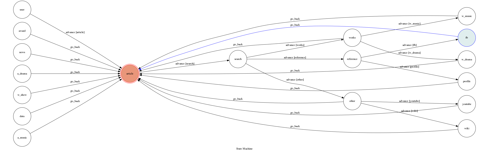

# TOC Project 2017

Template Code for TOC Project 2017

A telegram bot based on a finite state machine

### Run Locally
You can either setup https server or using `ngrok` as a proxy.

**`ngrok` would be used in the following instruction**

```sh
ngrok http 5000
```

After that, `ngrok` would generate a https URL.

You should set `WEBHOOK_URL` (in app.py) to `your-https-URL/hook`.

#### Run the sever

python3 app.py

## Finite State Machine


## Usage
The initial state is set to `user`.

Note:It can only input Foreign Article
This is a machine to let you search the article's information which you input.
First you input an name without chinese,then click the option of the information which you want do search.
Then when the searching is finished. It will give a chat to you.

Then it will let you to input another article again.

Every time `user` state is triggered to `advance` to another state, when finish searching, it will go back to 'article' state to let user input.

* user
	* Input: The article name you want to search,then choose the option to get your information.


## Author
Collin (https://github.com/collin85820/TOC-Project.git)
